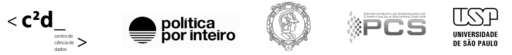

# Tracking Changes in Environmental Policy in the Brazilian Federal Official Gazette

This repository is related to the paper *Tracking Changes in Environmental Policy in the Brazilian Federal Official Gazette*, by Flávio Nakasato Cação <sup>1</sup>, Anna Helena Reali Costa <sup>1</sup>, Natalie Unterstell <sup>2</sup>, Liuca Yonaha <sup>2</sup>, Taciana Stec <sup>2</sup> and Fábio Ishisaki <sup>2</sup>. It was accepted at the *International Conference on the Computational Processing of Portuguese* (PROPOR'22).

The version of the *Government Actions Tracker* (GAT) dataset annotated by domain experts and used in this work is available in ```databaset/gat.csv```. It is worth mentioning this dataset is part of an active work that is updated daily by the **Política Por Inteiro** team; thus, its latest version can be consulted directly on the [organization's website](https://www.politicaporinteiro.org/monitor-de-atos-publicos/).

## Acknowledgments
This work is the result of an academic partnership between the Escola Politécnica of Universidade de São Paulo and [Política Por Inteiro](https://www.politicaporinteiro.org). Without the data curation efforts of Política Por Inteiro experts, building the NLP model would not have been possible. Also, this work was financed in part by the Coordenação de Aperfeiçoamento de Pessoal de Nível Superior (CAPES, Finance Code 001), the Itaú Unibanco S.A., through the Programa de Bolsas Itaú (PBI) of the Centro de Ciência de Dados (C2D) of the Escola Politécnica of the Universidade de São Paulo (USP), and by the Conselho Nacional de Desenvolvimento Científico e Tecnologico (CNPq) (grant 310085/2020-9). 

The data, views and opinions expressed in this article are those of the authors and do not necessarily reflect the official policy or position of the financiers.

<br>

---
<sup>1</sup> *Polytechnic School, University of Sao Paulo, Sao Paulo, Brazil*
<br>
<sup>2</sup> *Política por Inteiro, Sao Paulo, Brazil*


